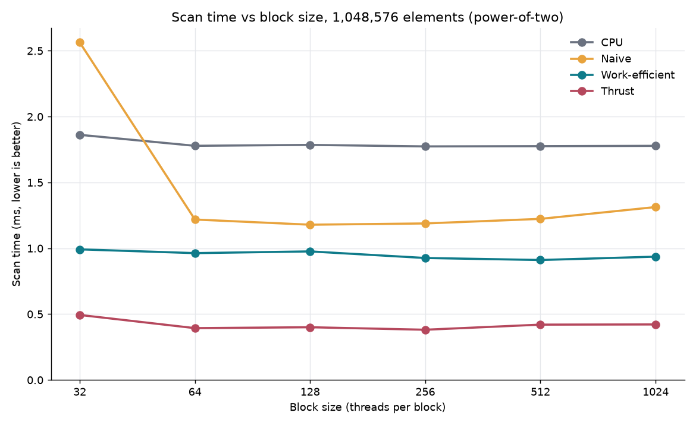
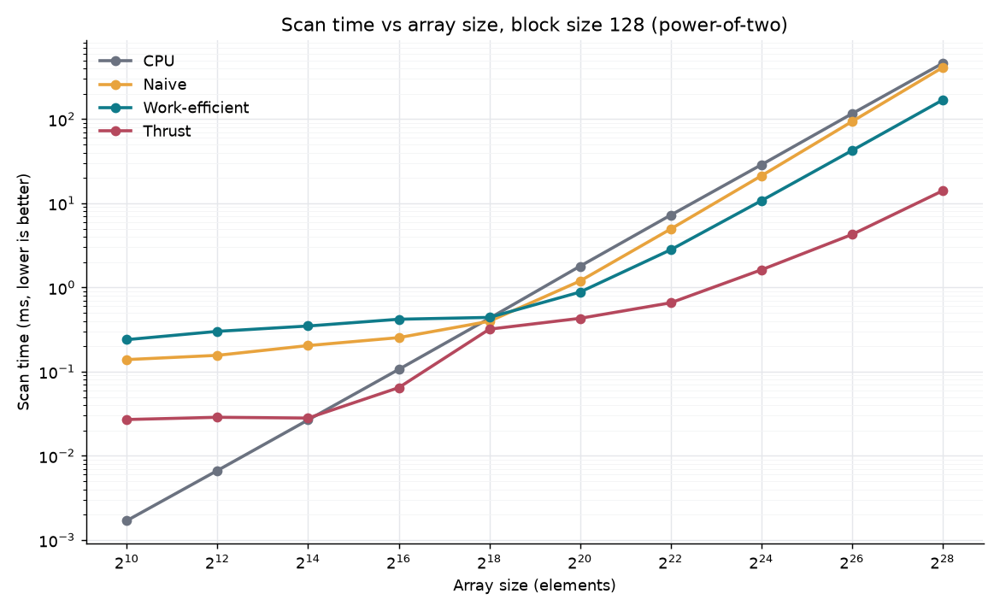
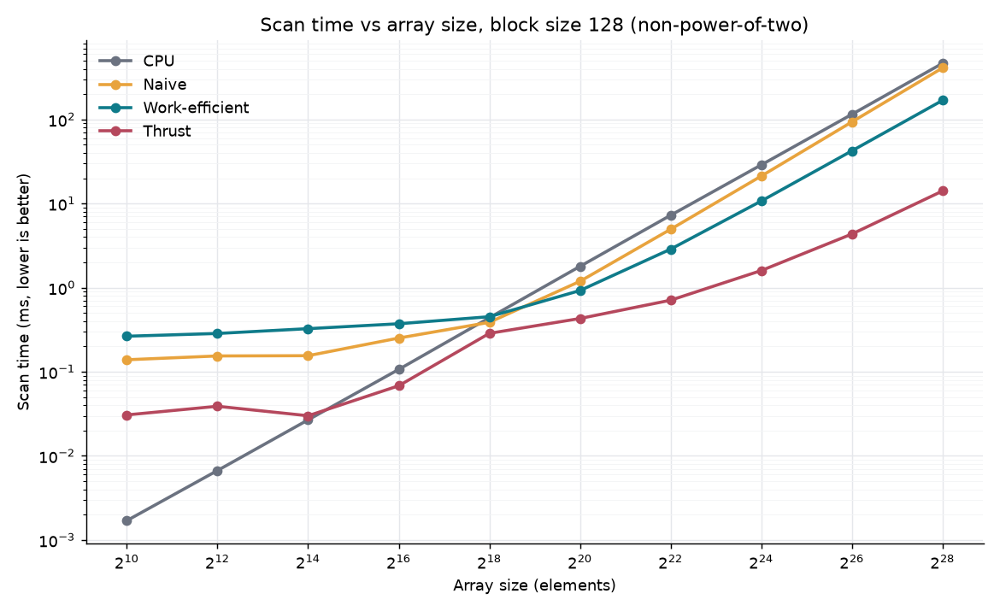

CUDA Stream Compaction
======================

**University of Pennsylvania, CIS 565: GPU Programming and Architecture, Project 2**

* Mark Melkumyan
  * [LinkedIn](https://www.linkedin.com/in/mark-melkumyan/), [personal website](https://www.marklikes.art/)
* Tested on: Windows 11, i7-10750H @ 2.60GHz, 64GB RAM, GTX 1650 Ti 4096MB

## What is stream compaction?

Stream compaction takes an array of integers and removes all zeros.

> Ex. `[1,2,0,0,5,6,0,8,0]` -> `[1,2,5,6,8]`

This is needed especially for the next assignment (CUDA Pathtracer) as we'll need to discard some number of rays each pass. Doing this sequentially on the CPU is incredibly slow, so in this project we parallelize it on the GPU. This is done in a few steps:

1. **Create boolean mask**
   > `[1,2,0,0,5,6,0,8,0]` ->  `[1,1,0,0,1,1,0,1,0]`
2. **Create indices array**
   > `[1,1,0,0,1,1,0,1,0]` ->  `[1,2,2,2,3,4,4,5,5]`

    A scan sums all elements in the ray up to and including that index. By scanning the bool mask, we get an array mapping the original true values to their final position.
3. **Scatter to final array**
   
   Using the bool mask on indices array, map original values to final indices
   > `[1,2,0,0,5,6,0,8,0]` // Input values 

   > `[1,1,0,0,1,1,0,1,0]` // Bool mask

   > `[1,2,2,2,3,4,4,5,5]` // Indices

   > `[1,2,-,-,3,4,-,5,-]` // Masked indices

   > `[1,2,5,6,8]` // Output values

This algorithm is implemented 4 ways: 
- **CPU**: Using a sequential CPU algorithm *(for comparison)*
- **Naive**: Using a naive O(n log(n)) GPU algorithm
- **Work-Efficient**: Using a better O(n) GPU algorithm
- **Thrust**: Wrapping a `thrust` implementation *(for analysis)*

## Performance analysis

Methodology:

- CPU is timed using `std::chrono`, and GPU is timed using CUDA events.
- Only one implementation was tested per run, as this avoids one implementation's setup work benefiting the others.
- Each scan was run twice, with the first run discarded. This was done to let the GPU "warm up", and avoids us measuring setup costs.
- Each implementation was measured 5 times, with the median taken as the final number.
- Array sizes max out at 2^28. The prefix sum accumulates into an `int`, so larger arrays overflow it unless the input values are shrunk. Past 2^29 the GPU also oversubscribes its 4GB and the timings measure PCIe paging rather than the scan.

---
### Q1 - Optimal Block Size

Below is a graph calculating the scan time VS block size for each implementation.




#### Notes:

- **CPU**: Consistent across all block sizes because the CPU implementation is independent from the block size param (as blocks are GPU only). Shown here for comparison.
- **Naive**: Performs significantly worse at block size of 32. My Turing GPU has two limits on each SM: at most 16 blocks, and at most 1024 threads. At a block size of 32 threads, and max of 16 blocks, that's 16x32 = 512 threads (only 50% of the max capacity!). This results in less efficiency.
  - Otherwise, sizes 64-1024 are mostly flat, with 128 barely performing better than the rest.
- **Work-efficient**: This method performs consistently better than naive, but performs evenly across all block sizes. 512 barely performing better than the rest.
- **Thrust**: The best performer among all implementations. It performs roughly evenly across all block sizes. Thrust ignores our `blockSize` param and sets it internally, so 256 winning is likely noise.

Above a block size of 64, each implementation's performance is essentially flat. As for which implementation is best, it goes **Thrust** > **Work-Efficient** > **Naive** > **CPU** *(for block sizes >= 64 and array sizes > 2^18).*

---
### Q2 - GPU Scan Comparison

Below is a comparison of GPU scans (Naive, Work-Efficient, and Thrust) VS the CPU scan for varying array sizes.





#### Analysis:

Performance bottlenecks for each implementation:

**CPU**: 
- CPU performs best at array sizes below 2^18, but worse afterwards. GPU kernels suffer at smaller arrays due to the cost of launching kernels (log N launches). The CPU doesn't have to worry about this cost.

**Naive**: 
- Performs quite poorly overall. Worse than CPU up to array sizes of 2^18 due to the cost of launching kernels, but performs *barely* better afterwards. 
- [n threads] X [log n iterations] = O(n log n) performance.
- Every thread is launched each iteration, whether or not it does useful work.

**Work-efficient**: 
- Work efficient performs noticeably better than Naive. Rather than O(n log n), it performs at O(n). This is due to its efficient allocation of threads. Each iteration, we only invoke the exact number of threads we need.
- [log n iterations], but half threads each iteration = O(n) performance.
- It performs the worst below array sizes of 2^18. This is likely because it launches 2(log n) kernels total (a log(n) upsweep loop followed by a log(n) downsweep loop), so the launch overhead is higher than Naive's log(n).

**Thrust**: 
- The best GPU performer at every array size.
- Nsight Compute indicates only *two* kernel launches per scan, regardless of n. My work-efficient scan launches 2(log n) kernels. Thrust appears to use a completely different algorithm without the upsweep/downsweep. It appears to be using a "decoupled-lookback scan", which only performs one pass over global memory.
- According to Nsight Compute, Thrust's `DeviceScanKernel` achieves 84% memory throughput and 93% achieved occupancy. It appears the wall here was memory (physical limitations of my device).

For all implementations, the power-of-two and non-power-of-two graphs are nearly identical.

---
### Q3 - Program Output

Output for array of size 1 << 20:

```
****************
** SCAN TESTS **
****************
    [  37  26  37  16  11  22  30   3  46  14   7  31  48 ...   5   0 ]
==== cpu scan, power-of-two ====
   elapsed time: 1.7924ms    (std::chrono Measured)
    [   0  37  63 100 116 127 149 179 182 228 242 249 280 ... 25676720 25676725 ]
==== cpu scan, non-power-of-two ====
   elapsed time: 1.9259ms    (std::chrono Measured)
    [   0  37  63 100 116 127 149 179 182 228 242 249 280 ... 25676650 25676691 ]
    passed 
==== naive scan, power-of-two ====
   elapsed time: 1.26374ms    (CUDA Measured)
    passed 
==== naive scan, non-power-of-two ====
   elapsed time: 1.17741ms    (CUDA Measured)
    passed 
==== work-efficient scan, power-of-two ====
   elapsed time: 0.97584ms    (CUDA Measured)
    passed 
==== work-efficient scan, non-power-of-two ====
   elapsed time: 0.872032ms    (CUDA Measured)
    passed 
==== thrust scan, power-of-two ====
   elapsed time: 2.58643ms    (CUDA Measured)
    passed 
==== thrust scan, non-power-of-two ====
   elapsed time: 0.39264ms    (CUDA Measured)
    passed 

*****************************
** STREAM COMPACTION TESTS **
*****************************
    [   1   2   1   0   3   2   0   1   0   2   3   3   0 ...   3   0 ]
==== cpu compact without scan, power-of-two ====
   elapsed time: 2.7354ms    (std::chrono Measured)
    [   1   2   1   3   2   1   2   3   3   1   1   2   1 ...   3   3 ]
    passed 
==== cpu compact without scan, non-power-of-two ====
   elapsed time: 2.8372ms    (std::chrono Measured)
    [   1   2   1   3   2   1   2   3   3   1   1   2   1 ...   2   1 ]
    passed 
==== cpu compact with scan ====
   elapsed time: 6.8761ms    (std::chrono Measured)
    [   1   2   1   3   2   1   2   3   3   1   1   2   1 ...   3   3 ]
    passed 
==== work-efficient compact, power-of-two ====
   elapsed time: 1.22582ms    (CUDA Measured)
    passed 
==== work-efficient compact, non-power-of-two ====
   elapsed time: 1.16218ms    (CUDA Measured)
    passed 
```

## Extra Credit

### Part 5: Why is My GPU Approach So Slow? (+5)

My work-efficient algorithm does not suffer the slowdown described in the instructions. It's roughly 2.4x faster than the naive scan at large sized arrays.

The reason is:
- **A**: it only launches `n/2^(d+1)` threads at every loop: `int n_d = paddedN / twoDPlusOne;`
- **B**: Each thread remaps its dense index onto the strided tree position it owns: `k = k * twoDPlusOne;`

## Build Notes

### CMakeLists Changes

  Modified to pass `/Zc:preprocessor` to MSVC via nvcc:
  ```cmake
  if(MSVC)
      target_compile_options(stream_compaction PRIVATE
          "$<$<COMPILE_LANGUAGE:CUDA>:-Xcompiler=/Zc:preprocessor>")
  endif()
  ```
  - This was done because my version of CUDA (13.3) gave me an error when MSVC was used as the preprocessor. I was unable to compile `thrust.cu` with it. 